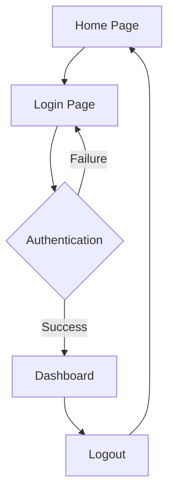

## 1. Product Overview
A minimal web application built with React and Supabase providing user authentication and basic data management capabilities.
- Target users: Developers and small teams needing a quick-start full-stack solution
- Core value: Rapid prototyping with built-in authentication and database

## 2. Core Features

### 2.1 User Roles
| Role | Registration Method | Core Permissions |
|------|---------------------|------------------|
| User | Email registration | Create/read own data, basic app features |
| Admin | Manual assignment | Full data access, user management |

### 2.2 Feature Module
Our application consists of the following main pages:
1. **Home page**: Welcome section, navigation menu, feature overview
2. **Login page**: User authentication form, registration link
3. **Dashboard page**: User data display, profile management, logout

### 2.3 Page Details
| Page Name | Module Name | Feature description |
|-----------|-------------|---------------------|
| Home page | Welcome section | Display app title, brief description, and call-to-action buttons for login/register |
| Home page | Navigation | Top navigation bar with brand logo and auth status indicator |
| Login page | Auth form | Email/password input fields with validation and submit button |
| Login page | Registration link | Link to registration form for new users |
| Dashboard page | User profile | Display current user email and account creation date |
| Dashboard page | Logout button | Secure logout functionality redirecting to home page |

## 3. Core Process
**User Authentication Flow:**
1. User visits home page and clicks login button
2. User enters credentials on login page
3. System authenticates via Supabase Auth
4. Successful login redirects to dashboard
5. User can logout from dashboard to return home

## 4. User Interface Design
### 4.1 Design Style
- Primary color: #3B82F6 (blue-500)
- Secondary color: #10B981 (emerald-500)
- Button style: Rounded corners with hover effects
- Font: System-ui, 16px base size
- Layout: Centered content with max-width container
- Icons: Lucide React icons for consistency

### 4.2 Page Design Overview
| Page Name | Module Name | UI Elements |
|-----------|-------------|-------------|
| Home page | Welcome section | Centered hero with gradient background, large heading, description text, two primary buttons |
| Home page | Navigation | Fixed top bar with logo on left, auth buttons on right, subtle shadow |
| Login page | Auth form | Card-based form with input fields, submit button, link to register below |
| Dashboard page | User profile | Clean card displaying user info with avatar placeholder, creation date |
| Dashboard page | Logout button | Secondary button in top-right of dashboard card |

### 4.3 Responsiveness
Desktop-first design approach with mobile responsiveness. Layout adapts to screen sizes with responsive grid and flexible containers.