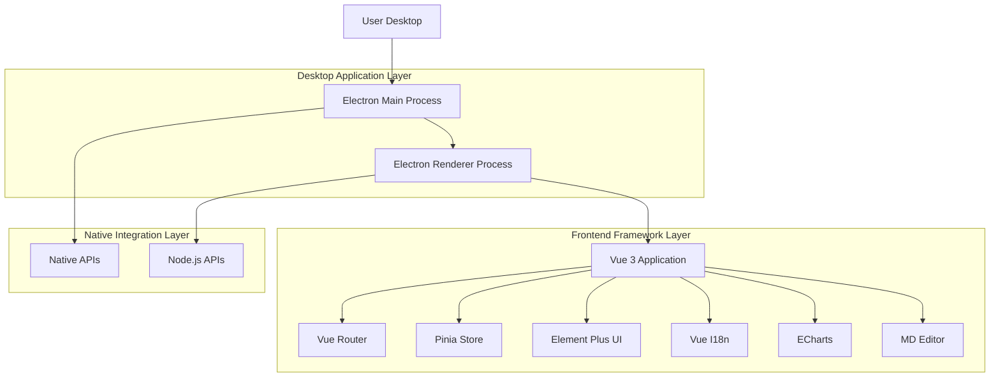
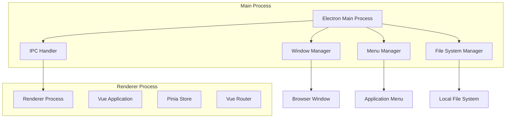
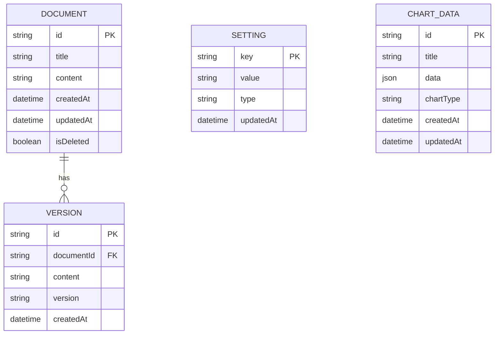

## 1. Architecture design



## 2. Technology Description

- Frontend: Vue@3.4 + Element Plus@2.7.8 + Vite@5.3
- Initialization Tool: vite-init
- Desktop Framework: Electron@31.3.0
- State Management: Pinia@2.2.0
- Routing: Vue Router@4.4
- Internationalization: Vue I18n@9
- Chart Component: ECharts@5.5.1
- Markdown Editor: md-editor-v3@4.18.0
- Mock Data: MockJS@1.1.0
- Build Tool: electron-builder@24.13.3
- Bridge Plugin: vite-plugin-electron@0.28.7
- Backend: None (Desktop application with local data)

## 3. Route definitions

| Route | Purpose |
|-------|---------|
| / | Home page, main dashboard |
| /settings | Application settings and preferences |
| /editor | Markdown editor page |
| /charts | Data visualization with ECharts |
| /about | Application information |

## 4. API definitions

### 4.1 Electron IPC APIs

Main process communication
```
ipcMain.handle('app:getVersion')
ipcMain.handle('app:getPath')
ipcMain.handle('window:minimize')
ipcMain.handle('window:maximize')
ipcMain.handle('window:close')
```

Renderer process communication
```
ipcRenderer.invoke('app:getVersion')
ipcRenderer.invoke('app:getPath')
ipcRenderer.invoke('window:minimize')
```

### 4.2 File System APIs

File operations
```
ipcMain.handle('file:read')
ipcMain.handle('file:write')
ipcMain.handle('file:delete')
ipcMain.handle('file:openDialog')
ipcMain.handle('file:saveDialog')
```

## 5. Server architecture diagram



## 6. Data model

### 6.1 Data model definition



### 6.2 Data Definition Language

Document Table (documents)
```sql
-- Local storage schema using IndexedDB or file-based storage
-- No SQL DDL needed for desktop application
-- Data stored in JSON format locally
```

Settings Store (settings.json)
```json
{
  "theme": "light",
  "language": "zh-CN",
  "fontSize": 14,
  "autoSave": true,
  "autoSaveInterval": 30000,
  "recentFiles": [],
  "windowBounds": {
    "width": 1200,
    "height": 800,
    "x": 100,
    "y": 100
  }
}
```