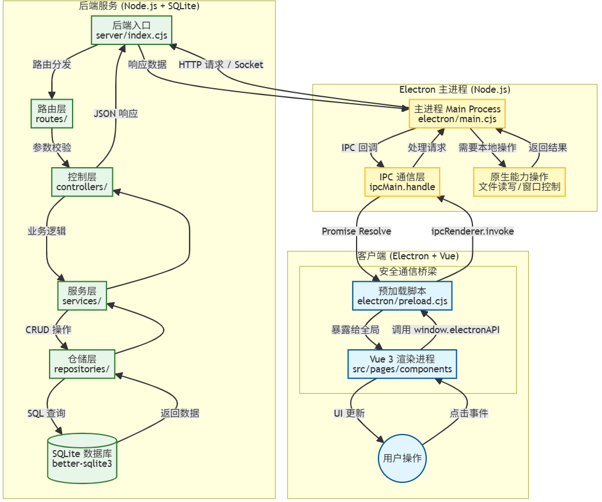
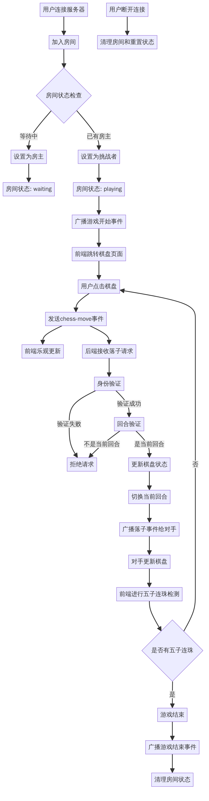
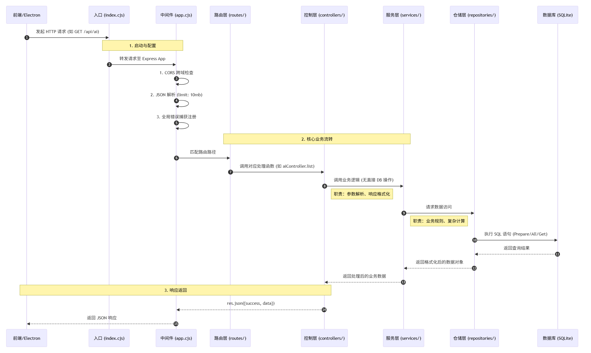

# ElectTool 全栈开发与部署实践分享稿

## 1. 项目概览

### 1.1 **【技术栈介绍】**
- **前端**：Vue 3 + Ant Design Vue。
- **桌面壳**：Electron，提供一定系统能力（文件读写、窗口管理）。
- **后端**：Node.js + Socket.io，实现了数据服务与实时通信。
- **数据层**：SQLite (better-sqlite3)，轻量级的本地数据存储。
- **工程化**：Vite 构建，GitHub Actions 自动化部署。

### 1.2 **【目录结构导览】**
```
d:\DXY\ElectTool\
├── .github/                # GitHub 配置 (CI/CD)
├── build/                  # 打包资源目录 (图标等)
├── electron/               # Electron 主进程代码
│   ├── main.cjs            # 主进程入口 (窗口, IPC, 数据库)
│   └── preload.cjs         # 预加载脚本 (安全 API)
├── server/                 # 后端服务代码
├── src/                    # 前端渲染进程代码 (Vue)
│   ├── api/                # API 调用模块
│   ├── assets/             # 静态资源 (图片, 地图json文件, 字体等)
│   ├── components/         # 公共组件
│   ├── pages/              # 页面视图 (AI, Map, 3D 等)
│   ├── stores/             # Pinia 状态管理
│   ├── utils/              # 工具函数
│   └── main.ts             # 入口文件
├── BUILD_GUIDE.md          # 打包发布指南
├── DEPLOY.md               # 服务器部署指南
└── package.json            # 项目依赖配置
```
### 1.3 ** Electron 应用全栈架构交互流程图 **


## 2. Electron 进程架构

Electron 应用采用 **多进程架构**，主要包含 **主进程 (Main Process)** 和 **渲染进程 (Renderer Process)**。通过 **预加载脚本 (Preload Script)** 和 **IPC (Inter-Process Communication)** 进行通信。

### 2.1 主进程 (Main Process)

**入口文件**: `electron/main.cjs`
**核心职责**: 它是整个应用的控制中心，负责管理窗口、系统交互和原生能力。

#### 2.1.1 窗口创建与安全配置
我们在 `createWindow` 函数中初始化 `BrowserWindow`。为了安全起见，遵循“最小权限原则”：

```javascript
mainWindow = new BrowserWindow({
  // 窗口尺寸与外观配置
  webPreferences: {
    preload: join(__dirname, '../electron/preload.cjs'), // 注入预加载脚本
    sandbox: false,         // 禁用沙箱 
    contextIsolation: true, // 【关键】开启上下文隔离
    nodeIntegration: false, // 【关键】禁用 Node.js 集成
    enableRemoteModule: false // 禁用 Remote 模块
  }
})
```

#### 2.1.2 环境区分与加载
主进程需要根据当前是 **开发环境** 还是 **生产环境** 来决定如何加载页面：

```javascript
if (process.env['ELECTRON_RENDERER_URL']) {
  // 开发模式：加载 Vite 启动的本地服务 URL (http://localhost:5173)
  mainWindow.loadURL(process.env['ELECTRON_RENDERER_URL'])
} else {
  // 生产模式：加载打包后的本地 HTML 文件
  mainWindow.loadFile(join(__dirname, '../dist/index.html'))
}
```

#### 2.1.3 IPC 消息处理器
主进程通过 `ipcMain.handle` 注册监听器，响应渲染进程的请求。

- **系统能力暴露**：如获取应用版本、系统路径。
- **窗口控制**：最小化、最大化、关闭窗口。
- **文件操作**：读取、写入、删除文件（使用 Node.js `fs` 模块）。
- **原生对话框**：调用 `dialog.showOpenDialog` 选择文件。

```javascript
// 示例：处理文件读取请求
ipcMain.handle('file:read', async (_, filePath) => {
  try {
    const content = await fs.readFile(filePath, 'utf-8')
    return { success: true, content }
  } catch (error) {
    return { success: false, error: error.message }
  }
})
```

---

### 2.2 预加载脚本 (Preload Script)

**文件路径**: `electron/preload.cjs`
**核心职责**: 它是连接主进程与渲染进程的 **安全桥梁**。

它在渲染进程加载页面之前运行，具有访问 Node.js API 的能力。我们通过 `contextBridge` 将特定的、安全的 API 暴露给全局 `window` 对象，而不是直接暴露整个 `ipcRenderer`。

```javascript
const { contextBridge, ipcRenderer } = require('electron')

contextBridge.exposeInMainWorld('electronAPI', {
  // 暴露版本获取接口
  getVersion: () => ipcRenderer.invoke('app:getVersion'),
  
  // 暴露窗口控制接口
  minimizeWindow: () => ipcRenderer.invoke('window:minimize'),
  
  // 暴露文件操作接口 (仅允许通过特定通道通信)
  readFile: (filePath) => ipcRenderer.invoke('file:read', filePath),
  // ... 其他 API
})
```

这样，前端代码只能调用 `window.electronAPI.readFile(...)`，而无法随意使用 Node.js 的能力，大大提高了安全性。

---

### 2.3 渲染进程 (Renderer Process)

**入口文件**: `src/main.ts`
**核心职责**: 负责页面 UI 展示和用户交互，本质上就是一个标准的 Vue 3 单页应用 (SPA)。

#### 2.3.1 调用 Electron 能力
在 Vue 组件中，我们通过预加载脚本暴露的 `window.electronAPI` 来调用系统能力。

```typescript
// 示例：在 Vue 组件中读取文件
const handleFileRead = async () => {
  const result = await window.electronAPI.readFile('C:/test.txt');
  if (result.success) {
    console.log('文件内容:', result.content);
  }
};
```

#### 2.3.2 前端工程化配置 (Vite)
为了适配 Electron 环境，`vite.config.ts` 做了一些特殊配置：

```typescript
export default defineConfig({
  // 使用相对路径 './'，确保在 file:// 协议下能正确找到资源
  base: "./", 
  server: {
    // 开发代理配置，解决本地开发时的跨域问题
    proxy: {
      '/socket.io': { ... }
    }
  },
  // ...
});
```

---

## 3. 前端服务

### 3.1 项目细节

#### 3.1.1 主题切换动效 (View Transitions API)

大家可能注意到了点击右上角切换主题时的**圆形扩散效果**，这不是简单的 CSS Transition，而是使用了浏览器原生的 **View Transitions API**。

**【实现逻辑】**

1.  **捕获点击位置**：获取鼠标点击坐标 $(x, y)$。
2.  **计算扩散半径**：计算点击点到屏幕最远角的距离，作为扩散圆的最大半径。
3.  **启动过渡**：调用 `document.startViewTransition(callback)`。
    - 浏览器先截图当前屏幕（旧视图）。
    - 执行 `callback`（切换 CSS 变量/类名，改变主题）。
    - 浏览器截图新屏幕（新视图）。
4.  **执行动画**：通过 CSS 伪元素 `::view-transition-new(root)` 控制蒙层的 `clip-path`，从一个小圆扩散到覆盖全屏。
5. 性能：浏览器对截图进行 GPU 合成动画，比操作大量 DOM 节点的 CSS 动画要快得多，且不掉帧；并且业务逻辑只需要负责“切换类名”，动画逻辑完全由 CSS 处理，代码解耦
 
_(代码位置: `src/components/ThemeSwitch.vue`)_

---

#### 3.1.2 图片格式转换

图片格式转换一般需要后端处理，但实际上用纯前端（渲染进程）就能完成。

**【核心逻辑：Canvas 转换】**
*(代码位置: `src/pages/tools/components/ImageConverter.vue`)*

1.  **读取图片**：使用 `<input type="file">` 读取用户上传的图片文件。
2.  **绘制到 Canvas**：将图片绘制到 HTML Canvas 上，这里可以进行缩放、裁剪等操作。
    ```javascript
    const canvas = document.createElement("canvas");
    const ctx = canvas.getContext("2d");
    ctx.drawImage(img, 0, 0, width, height);
    ```
3.  **格式转换**：利用 `canvas.toBlob()` 方法导出为不同格式。
    ```javascript
    // 转为 JPG (指定质量)
    canvas.toBlob(callback, "image/jpeg", 0.9);
    // 转为 PNG
    canvas.toBlob(callback, "image/png");
    ```
4.  **特殊格式 (ICO/ICNS)**：
    *   **难点**：浏览器 Canvas 原生仅支持 `image/png` 和 `image/jpeg` 导出，不支持 Windows 图标 (.ico) 和 macOS 图标 (.icns)。
    *   **解决**：我们需要**手动构建二进制文件**。
    *   **实现细节**：
        1.  先将 Canvas 导出为 PNG 的 `Blob` 数据。
        2.  读取 PNG 的二进制流 (`Uint8Array`)。
        3.  **拼接 ICO 文件头**：
            *   Header (6字节): `00 00` (保留) + `01 00` (ICO类型) + `01 00` (图片数量)。
            *   Directory (16字节): 包含图片的宽、高、色深、PNG数据大小、PNG数据偏移量。
        4.  最后将 `[Header, Directory, PNG Data]` 组合成一个新的 Blob 对象，MIME 类型设为 `image/x-icon`。
    *(代码位置: `ImageConverter.vue` 中的 `convert` 方法)*

#### 3.1.3 socket 通信（五子棋）

这是一个典型的**实时双向通信**场景。我们将重点讲解**Socket 功能**、**房间管理**和**游戏状态同步**的完整闭环。

**【用到的 Socket.io 核心功能】**
1.  **命名空间与房间 (Rooms)**: 利用 `socket.join(roomId)` 和 `socket.to(roomId).emit(...)` 实现房间隔离，确保 A 房间的对战不影响 B 房间。
2.  **事件广播 (Broadcast)**: 使用 `io.emit` 向所有人广播房间列表，使用 `socket.to(roomId).emit` 向房间内对手广播落子。
3.  **连接管理**: 监听 `connection` 和 `disconnect` 事件，处理用户断线后的房间清理和状态重置。
4.  **握手查询 (Handshake Query)**: 在连接时通过 `query` 参数传递 `userId`，实现断线重连后的身份识别。

**【流程图】**


**【关键逻辑解析】**

1.  **房间状态管理 (`server/socket/chessHandler.cjs`)**：
    后端维护了一个 `rooms` 对象，记录每个房间的详细状态：
    ```javascript
    rooms[roomId] = {
      id: roomId,
      hostId: 'socket_id_1',   // 房主 ID
      guestId: 'socket_id_2',  // 挑战者 ID
      status: 'waiting',       // waiting | playing
      pieces: {},              // 棋盘数据: key="x,y", value={color}
      currentTurn: 'black'     // 当前回合
    }
    ```

2.  **加入房间与游戏开始**：
    当第二个用户调用 `chess-join-room` 时：
    *   后端检查房间是否存在且状态为 `waiting`。
    *   将 `status` 改为 `playing`。
    *   向房间内所有用户广播 `chess-game-start` 事件，前端收到后跳转到棋盘页面。

3.  **落子与胜负判定**：
    *   **前端**：点击棋盘 -> 发送 `chess-move` 事件 -> (乐观更新) 本地先落子。
    *   **后端**：
        1.  **身份验证**：确保是房间内的玩家，且颜色对应（黑方只能下黑子）。
        2.  **回合验证**：`if (data.color !== room.currentTurn) return;` 防止连下。
        3.  **状态更新**：记录棋子位置，切换 `currentTurn`。
        4.  **广播**：`socket.to(roomId).emit('chess-move')` 通知对手更新棋盘。

4.  **胜利条件 (前端计算)**：
    虽然为了安全通常由后端判定，但为了演示简单，本项目由前端在每次落子后进行**五子连珠**算法检测：
    *   遍历当前落子点的 **横、竖、撇、捺** 四个方向。
    *   统计连续相同颜色的棋子数量，若 `>= 5` 则判定胜利。

---

### 3.2 自动化打包流程

结合 **Vite 构建** 和 **GitHub Actions 流水线**，实现了从代码提交到打包的自动化。

#### 3.2.1 前端构建配置 (Vite)

Electron 项目的打包分为两步：先构建前端资源，再打包桌面应用。

**【vite.config.ts 关键配置】**

```typescript
export default defineConfig({
  // 1. 基础路径设为相对路径 './'，确保 Electron 加载本地 file:// 协议时资源路径正确
  base: "./",
  
  // 2. 构建输出配置
  build: {
    outDir: "dist",    // 产物目录，Electron 主进程会加载这里的 index.html
    assetsDir: "assets",
    sourcemap: false,  // 生产环境关闭 sourcemap，减小体积并避免源码泄露
  }
});
```

#### 3.2.2 桌面打包配置 (electron-builder)

我们使用 `electron-builder` 将构建好的前端资源封装成 `.exe` 或 `.dmg`。配置位于 `package.json` 的 `build` 字段中：

```json
"build": {
  "appId": "com.elect.tool",
  "directories": {
    "output": "dist_electron", // 打包后的安装包存放目录
  },
  "files": [
    "dist/**",     // 包含 Vite 构建好的前端资源
    "electron/**"  // 包含主进程代码
  ],
  // 关键：将原生模块 (.node) 解压到 app.asar 外部，防止加载失败
  "asarUnpack": [
    "**/*.node"
  ],
  "win": {
    "target": "nsis", // Windows 使用 NSIS 安装向导
  },
  "mac": {
    "target": "dmg"   // macOS 使用 DMG 镜像
  }
}
```

#### 3.2.3 CI/CD 流水线 (GitHub Actions)

配置文件位于 `.github/workflows/build.yml`。

```yaml
name: Build/Release

on:
  push:
    tags:
      - 'v*' # 触发机制：只有打上 v 开头的 tag (如 v1.0.0) 时才触发构建

jobs:
  release:
    # 矩阵策略：同一份代码，同时在 macOS 和 Windows 虚拟机上运行
    runs-on: ${{ matrix.os }}
    strategy:
      matrix:
        os: [macos-latest, windows-latest]

    steps:
      # 拉取代码
      - name: Check out Git repository
        uses: actions/checkout@v4

      # 安装 Node.js 环境 (版本 20)
      - name: Install Node.js
        uses: actions/setup-node@v4
        with:
          node-version: 20

      # 安装依赖 (npm install)
      - name: Install Dependencies
        run: npm install

      # Windows 打包任务
      - name: Build & Release (Windows)
        if: matrix.os == 'windows-latest'
        uses: samuelmeuli/action-electron-builder@v1
        with:
          github_token: ${{ secrets.GITHUB_TOKEN }} # 自动获取 GitHub 权限
          release: ${{ startsWith(github.ref, 'refs/tags/v') }} # 是否发布到 Releases 页面
          args: '--win nsis' # 参数：构建 Windows NSIS 安装包 (.exe)

      # macOS 打包任务
      - name: Build & Release (macOS)
        if: matrix.os == 'macos-latest'
        uses: samuelmeuli/action-electron-builder@v1
        with:
          github_token: ${{ secrets.GITHUB_TOKEN }}
          release: ${{ startsWith(github.ref, 'refs/tags/v') }}
          args: '--mac dmg' # 参数：构建 macOS 镜像包 (.dmg)
```

---

## 4. 后端服务

### 4.1 数据库 Better-SQLite3

#### 4.1.1 为什么使用Better-SQLite

由于目前项目规模较小，且数据量不大，前期不需要复杂的数据库功能，所以没有使用 MySQL 等数据库，而是使用的Better-SQLite

- **优点**：
  - **高性能**：同步操作简单直接。
  - **零配置**：就是一个 `.db` 文件，无需安装数据库软件。
  - **进程内运行**：不需要 TCP 连接，没有网络开销。
- **缺点**：
  - **同步阻塞**：大量写入可能阻塞主线程（但在 Electron 中通常数据量不大，或可放入 Worker）。
  <!--  **二进制依赖**：需要编译 C++ 扩展，跨平台打包时要注意 ABI 兼容性。 -->

#### 4.1.2 数据库初始化与调用

_(代码位置: `server/db/sqlite.cjs`)_

**1. 初始化与建表**

```javascript
const Database = require('better-sqlite3')
const { join } = require('path')

// 初始化数据库连接
// 自动在 data 目录下创建 app.db 文件
const db = new Database(join(__dirname, '../data/app.db'))

// 建表：如果不存在则创建
db.exec(`
  CREATE TABLE IF NOT EXISTS users (
    id INTEGER PRIMARY KEY AUTOINCREMENT,
    name TEXT,
    email TEXT
  )
`)
```

**2. 增删改查 (CRUD) 操作**

- **插入数据 (Insert)**：使用 `run()`

  ```javascript
  // 使用预编译语句
  const insert = db.prepare('INSERT INTO users (name, email) VALUES (?, ?)')
  // 执行插入
  const info = insert.run('Alice', 'alice@example.com')
  console.log(info.lastInsertRowid) // 获取新生成的 ID
  ```

- **查询单条 (Select One)**：使用 `get()`

  ```javascript
  const getUser = db.prepare('SELECT * FROM users WHERE id = ?')
  const user = getUser.get(1)
  ```

- **查询多条 (Select All)**：使用 `all()`
  ```javascript
  const getAll = db.prepare('SELECT * FROM users')
  const users = getAll.all() // 返回数组
  ```

---

### 4.2. Node.js 后端服务架构

我们把后端代码放在 `server/` 目录下，采用经典的 **MVC (Model-View-Controller)** 分层架构，逻辑清晰，便于维护。

#### 4.2.1 后端目录结构解析

```
server/
├── index.cjs           # 【入口】HTTP 服务启动入口，Socket.io 初始化
├── app.cjs             # 【应用】Express App 配置，中间件挂载
├── routes/             # 【路由层】定义 URL 路径 (如 /api/ai, /api/user)
│   ├── ai.cjs          # AI 相关路由
│   └── ...
├── controllers/        # 【控制层】处理 HTTP 请求，参数校验，响应结果
│   ├── aiController.cjs
│   └── ...
├── services/           # 【服务层】核心业务逻辑，复杂计算，调用 Repo
│   ├── aiService.cjs
│   └── ...
├── repositories/       # 【仓储层】直接操作数据库 (SQL 语句)
│   ├── aiRepo.cjs
│   └── ...
├── db/                 # 【基础设施】数据库连接配置
│   └── sqlite.cjs
├── config/             # 【配置】环境变量，常量定义
└── utils/              # 【工具】通用函数
```
##### 后端服务全栈架构交互流程图



#### 4.2.2 核心中间件 (`app.cjs`)

在 `app.cjs` 中，我们加载了几个关键的中间件：

1.  **CORS (`cors`)**：
    - 允许跨域资源共享。在开发时，前端在 `localhost:5173`，后端在 `localhost:3002`，端口不同属于跨域。CORS 允许前端安全地调用后端接口。
2.  **JSON 解析器 (`express.json`)**：
    - 配置为 `limit: '10mb'`。默认 Express 请求体限制较小，调大是为了支持上传 Base64 图片等大体积数据。
3.  **路由挂载 (`app.use('/api', ...)`)**：
    - 将不同模块的路由挂载到 `/api` 路径下，例如 `/api/ai`，让接口结构清晰。
4.  **全局错误处理 (`errorHandler`)**：
    - 在最后挂载。当任何控制器抛出异常时，都会被这里捕获，统一返回 JSON 格式的错误信息，防止服务崩溃或请求挂起。

#### 4.2.3 请求处理全流程

当前端发起一个真实请求 `GET /api/ai/` (获取 AI 会话列表) 时，后端的流转过程如下：

1.  **入口 (Entry)**: `index.cjs` 启动服务，监听端口。
2.  **路由 (Router)**: `routes/ai.cjs` 匹配到路径 `/` (即 `/api/ai/`)，将请求转发给对应的控制器函数 `list`。
    ```javascript
    router.get('/', aiController.list)
    ```
3.  **控制器 (Controller)**: `controllers/aiController.cjs` 接收 `req` (请求) 和 `res` (响应)。它不处理业务，只负责解析参数，然后调用 Service。
    ```javascript
    const list = (req, res) => {
      // 调用 Service 层获取数据
      const sessions = aiService.getAllSessions()
      // 返回统一的 JSON 格式
      res.json({ success: true, data: sessions })
    }
    ```
4.  **服务 (Service)**: `services/aiService.cjs` 处理业务逻辑（比如数据格式化、权限检查），然后调用 Repository 获取数据。
    ```javascript
    const getAllSessions = () => {
      return aiRepo.getAll()
    }
    ```
5.  **仓储 (Repository)**: `repositories/aiRepo.cjs` 执行真正的 SQL 语句。
    ```javascript
    const getAll = () => {
      // 预编译 SQL 查询语句，按更新时间倒序排列
      const stmt = db.prepare('SELECT * FROM ai_sessions ORDER BY updated_at DESC')
      return stmt.all().map(row => ({
        ...row,
        messages: JSON.parse(row.messages) // 将数据库存的 JSON 字符串转回对象
      }))
    }
    ```

这种分层让代码各司其职：**Controllers 管输入输出，Service 管业务逻辑，Repo 管数据库**。

---

### 4.3. 后端服务的云端部署

虽然是桌面应用，但我们的 `server/` 目录是一个标准的 Node.js 应用，可以独立部署到云端。
详见 [DEPLOY.md](DEPLOY.md)

---

## 5. 总结与展望

**【总结】**
通过 ElectTool 这个项目，我们实践了 **Web 前端 -> Electron 桌面 -> CI/CD 自动化; Node 后端 -> 云端部署 ** 的全链路。

**【未来方向】**
接下来我们将探索更前沿的方向：

    **AI 深度集成** 目前ai调用只是简单的调用服务，后期考虑集成本地大模型，利用用户本地的 GPU 算力来实现更快、更有效的回答。

    **数据库优化** 目前数据库采用 SQLite，后续考虑迁移到 MySQL 或 PostgreSQL，以支持更多用户和更复杂的查询。

    **3D 模型渲染** 考虑集成更多3D模型渲染功能，如 3D 模型查看器、3D 模型编辑工具等。

    **Socket 通信** 考虑配置更多复杂场景，操作更多实践案件，如实时协作、多用户交互等。

谢谢大家！
